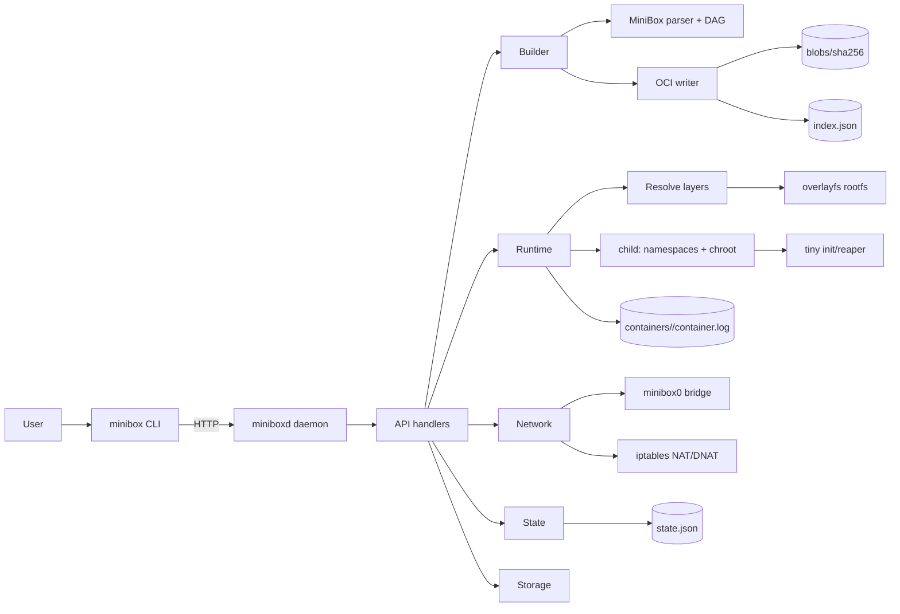

# minibox (beta)

`minibox` is a small Linux container engine written in Go. It builds images from **MiniBox** files, stores them in an OCI-like layout, and runs containers using Linux namespaces + overlayfs + a root daemon.

This repo is **beta** quality: it is usable for testing and learning, but there are known limitations (see **Limitations / downsides**).

---

## What is implemented today

- **CLI + daemon**
  - `minibox` (CLI)
  - `miniboxd` (daemon)
- **MiniBox image builds**
  - DAG blocks (`BASE`, `BLOCK`, `NEED`, `RUN`, `COPY`, `WORKDIR`, `ENV`, `AUTO-DEPS`, `START`)
  - Build caching (content-addressed layers)
  - Structured build logs + DAG summary
- **OCI-like storage**
  - blob store under `DataRoot/blobs/sha256`
  - `index.json` references by image name
- **Container runtime**
  - namespaces: PID/UTS/MNT/NET
  - overlayfs rootfs mount
  - `chroot` into container rootfs
  - tiny init/reaper (PID1 behavior)
  - seccomp (deny-list) + rlimits + capability drop (with a special DB-mode exception)
  - cgroups v2: memory/cpu/cpuset/io weight + OOM score adj + sysctls
- **Networking**
  - bridge `minibox0` + veth pairs
  - iptables NAT/DNAT port mappings (`-p host:container`)
  - lazy bridge setup (fast daemon startup)
- **State + UX**
  - persistent state: `state.json`
  - `ps` shows created, exit code, ports, health
  - `images` shows **size**
  - `logs`, `stats`, `stop`, `kill`, `rm`
  - `images --json`, `ps --json`
- **Image portability**
  - `save` / `load` to tar archive
- **Maintenance**
  - `system prune`
  - `system prune --build-cache` (clears build cache under `DataRoot/layers`)

---

## One diagram (end-to-end)



More diagrams: `docs/ARCHITECTURE_DIAGRAMS.md` and `docs/detailed/`.

---

## MiniBox DAG builds (implementation-level)

MiniBox supports a DAG-style build format where each `BLOCK` is an independently cacheable unit.

### Syntax (DAG)

Minimal example:

```text
BASE alpine

BLOCK runtime
    pkg nodejs
    pkg npm

BLOCK source
    workdir /app
    copy . /app

BLOCK deps
    NEED runtime
    NEED source
    auto-deps

BLOCK config
    NEED deps
    env PORT=3000
    port 3000

START node index.js
```

Key directives:

- `BASE <name>`: base rootfs (currently Alpine is supported)
- `BLOCK <name>`: named unit
- `NEED <block>`: dependency edge (this block sees dependent layers in its overlay stack)
- block instructions:
  - `RUN ...`, `COPY <src> <dst>`, `WORKDIR <path>`, `ENV KEY=VALUE`
  - `PKG <name>[@ver]` expands to `apk add --no-cache ...`
  - `AUTO-DEPS` detects manifests (e.g. `package.json`) and runs installers (e.g. `npm install`)
- `START ...`: image default command

### How parallelism works (waves)

The builder executes blocks in “waves”:

- Wave N contains all blocks whose `NEED` dependencies are already complete.
- Blocks in the same wave run concurrently.

This is why you see logs like:

```
[dag] wave=1 ready=runtime,layout
[dag] wave=2 ready=source
...
```

### How caching works (what makes a block CACHED)

Each block produces a content-addressed layer directory under:

- `DataRoot/layers/<hash>`

The cache key includes (implementation detail):

- parent hash + dependency names
- inherited workdir
- instruction stream (`RUN/COPY/WORKDIR/ENV/...`)
- **COPY source content hash** (directory tree hash) so changing files invalidates cache correctly
- whether `AUTO-DEPS` is enabled

If `DataRoot/layers/<hash>` exists, the block is reported as `CACHED`.

### How to structure blocks for maximum cache reuse

- Put slow, stable steps early:
  - `BLOCK runtime` for packages
  - `BLOCK deps` for dependency installs
- Keep `COPY .` isolated:
  - `BLOCK source` should only do `COPY` and simple workdir setup
- Use `NEED` edges honestly:
  - if a block needs files from another block, it must `NEED` it
  - don’t assume a “deps” block includes “source” unless you explicitly depend on it

### Clearing DAG build cache

Image removal (`rmi`) affects OCI index/blobs, but build cache is separate. To force a full rebuild:

```bash
minibox system prune --build-cache
```

For deeper details: `docs/ARCHITECTURE.md` and `docs/digrams`.

---

## Quickstart

### Install commands (recommended)

```bash
make install-user
export PATH="$HOME/.local/bin:$PATH"
```

Start daemon (requires root for networking + mounts):

```bash
sudo -E miniboxd
```

### Build an image

In a directory that contains a `MiniBox` file:

```bash
minibox build -t demo .
```

### Run

Foreground:

```bash
minibox run demo
```

Detached + port mapping:

```bash
minibox run -d -p 3001:3000 demo
minibox ps
```

### Basic maintenance

```bash
minibox system prune
minibox system prune --build-cache
```

---

## Safety notes (important)

This project runs a **root daemon** and performs host-level operations (mounts, iptables, bridge/veth). It is designed to avoid the class of host corruption issues caused by mount operations leaking into the host mount namespace, but:

- you should **test in a VM** before giving it to someone else
- always set a safe data root and avoid pointing it at system directories

Recommended:

```bash
export MINIBOX_DATA_ROOT="$HOME/.minibox-data"
```

---

## CLI overview

Core:
- `minibox ping`
- `minibox build -t <image> <context>`
- `minibox run ...`
- `minibox ps [-a] [--json]`
- `minibox logs <id>`
- `minibox exec [-it] <id> <cmd...>`
- `minibox stop [-t seconds] <id>`
- `minibox kill <id>`
- `minibox rm <id>`
- `minibox stats <id>`

Images:
- `minibox images [--json]`
- `minibox rmi <image>`
- `minibox save <image> <out.tar>`
- `minibox load <in.tar>`

System:
- `minibox system prune [--build-cache]`

Database containers (experimental):
- `minibox db run ...`

Full reference: `docs/CLI.md`.

---

## Performance knobs

Daemon startup:
- `MINIBOX_INDEX_ON_STARTUP=0` disables startup blob indexing
- `MINIBOX_BRIDGE_ON_STARTUP=0` disables startup bridge bring-up (bridge is created lazily when needed)

Build finalize:
- `MINIBOX_INDEX_LAYERS=0` disables layer indexing (faster finalize)

---

## Limitations / downsides (beta reality)

- **Root daemon required** for networking + overlay mounts.
- **DB containers are experimental**.
  - Some database images (Postgres example) can exit due to `/dev` expectations and kernel constraints; this will be improved.
- **Not a full OCI runtime**:
  - no full OCI spec parity (mounts, hooks, lifecycle, userns mapping completeness)
- **Security hardening is “good for a learning engine” but not Docker-level**:
  - seccomp profile is deny-list based (not a full policy engine)
  - capability dropping / DB-mode exception is pragmatic, not ideal for untrusted multi-tenant workloads
- **Image format compatibility**:
  - save/load is a simple archive of the internal OCI-like store (not Docker save format compatible)

---

## Remaining work (planned)

High priority:
- DB/runtime: stable `/dev` model for DB workloads; make DB-mode safe without “keep caps”
- Hardening: better default seccomp, safer sysctl surface, better drop model
- Networking: more deterministic cleanup; handle failures and retries robustly
- Build: faster `AUTO-DEPS` for Node (production-only installs), improved caching for large dep trees

Nice-to-have:
- per-command `--help` pages
- more stable JSON schemas and versioning

---

## Docs

- `docs/CLI.md` — commands and examples
- `docs/ARCHITECTURE.md` — full deep-dive
- `docs/digrams/` — Excalidraw diagrams

