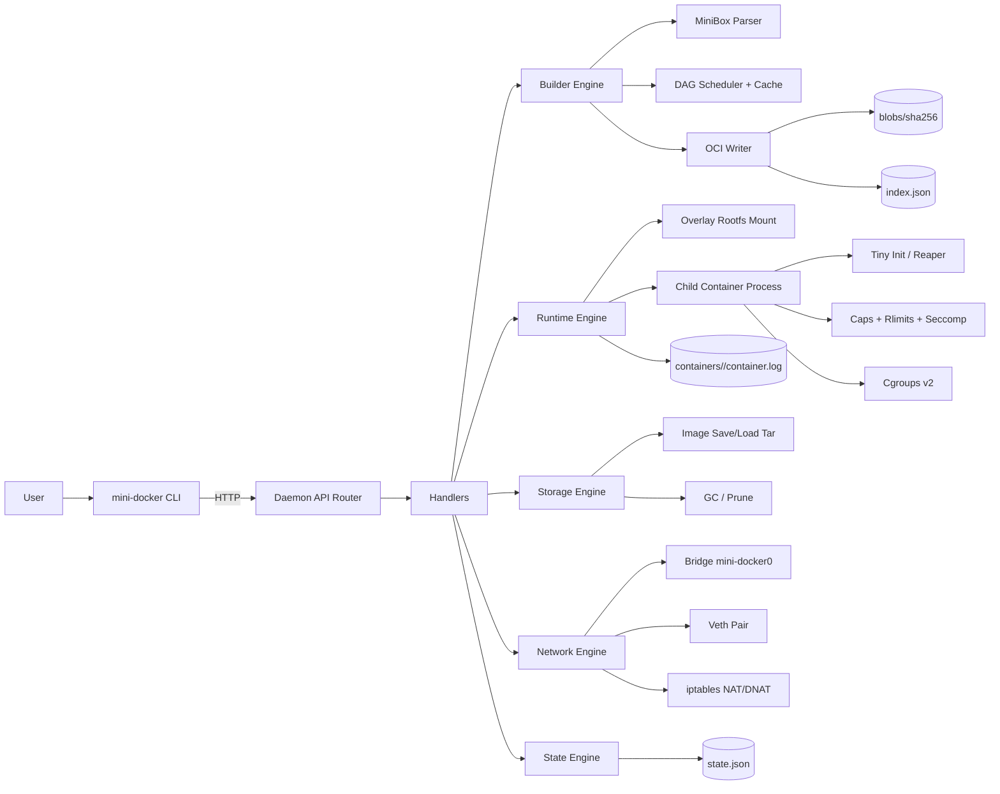
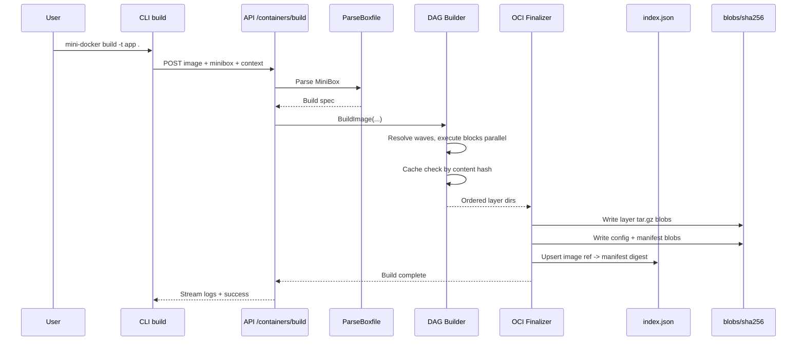
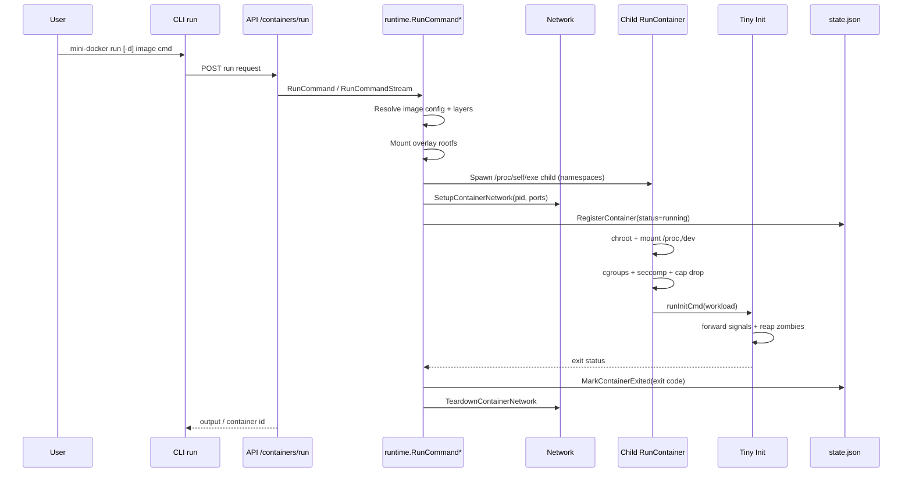
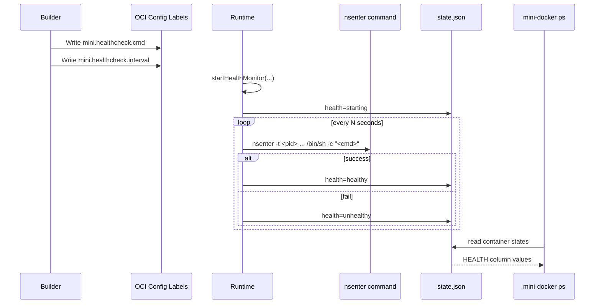
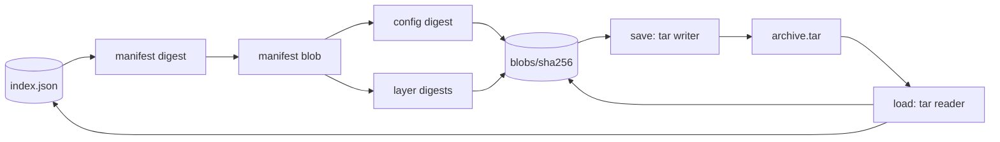
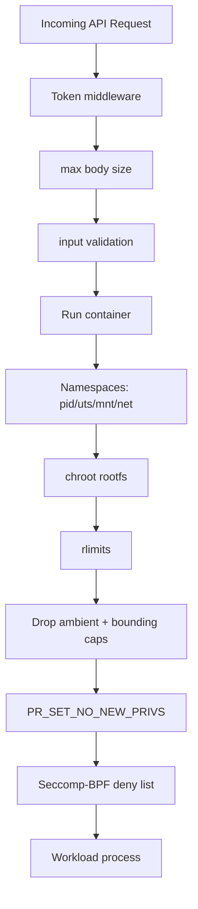
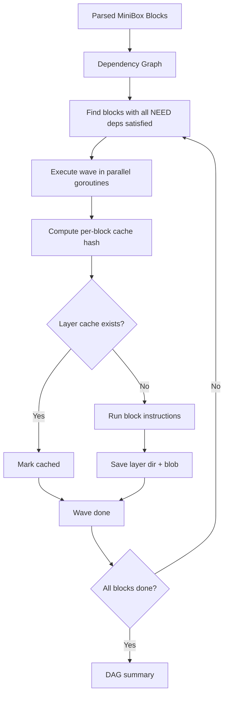
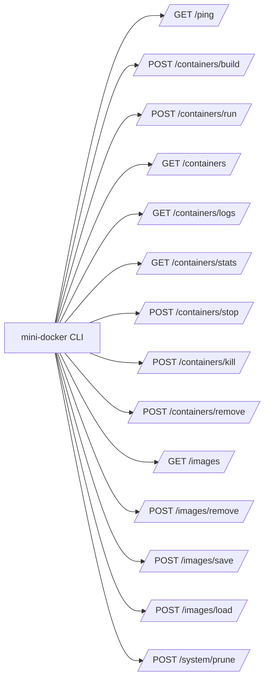

# mini-docker Architecture Diagrams

This file contains visual architecture diagrams for major features, plus one full end-to-end system diagram.

Use any Markdown viewer with Mermaid support to render these.

---

## 1) End-to-End System Architecture



---

## 2) Build Feature (MiniBox -> OCI Image)



---

## 3) Runtime Run Feature (Foreground/Detached)



---

## 4) Networking Feature

```mermaid
flowchart TD
    subgraph Host
      BR[Bridge mini-docker0 172.19.0.1/24]
      HV[veth-<id>]
      IPT1[iptables nat POSTROUTING MASQUERADE]
      IPT2[iptables nat PREROUTING/OUTPUT DNAT]
      IPT3[iptables filter FORWARD ACCEPT]
    end

    subgraph Container NetNS
      PV[eth0 (from vetp-<id>)]
      LO[lo]
      IP[172.19.0.x/24]
      GW[default via 172.19.0.1]
    end

    HV --- PV
    HV --> BR
    PV --> IP
    LO --> PV
    IP --> GW
    IPT2 --> PV
    PV --> IPT1
    IPT3 --> PV
```

---

## 5) Healthcheck Feature



---

## 6) Image Save/Load Feature



---

## 7) Graceful Daemon Shutdown Feature

```mermaid
sequenceDiagram
    participant SIG as SIGINT/SIGTERM
    participant D as Daemon main
    participant HS as HTTP Server
    participant NET as Network Teardown
    participant END as Process Exit

    SIG->>D: shutdown requested
    D->>HS: Shutdown(context)
    HS-->>D: stop accepting + drain inflight
    D->>NET: TeardownBridge()
    NET-->>D: iptables + bridge cleanup
    D-->>END: clean exit
```

---

## 8) Security Feature Stack



---

## 9) State + Observability Feature

```mermaid
flowchart LR
    RUN[Container start] --> REG[RegisterContainer]
    REG --> STATE[(state.json)]
    RUN --> LOG[(container.log)]
    HC[Health monitor] --> UH[UpdateContainerHealth]
    UH --> STATE
    EXIT[Process exit] --> MARK[MarkContainerExited]
    MARK --> STATE
    CLI1[mini-docker ps] --> STATE
    CLI2[mini-docker logs] --> LOG
    CLI3[mini-docker stats] --> CGFS[/sys/fs/cgroup + net metrics]
```

---

## 10) MiniBox DAG Wave Execution Feature



---

## 11) CLI <-> API Command Mapping Diagram



