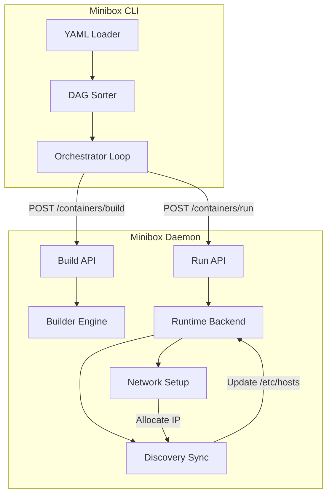

# Minibox Compose — Multi-Container Orchestration

**Minibox Compose** is a tool for defining and running multi-container Minibox applications. With Compose, you use a YAML file to configure your application's services, then with a single command, you create and start all the services from your configuration.

---

## Quick Start

1. Create a `minibox-compose.yaml` file:

```yaml
name: my-project
services:
  db:
    image: redis:latest
    db_mode: true
    data: /data
    ports:
      - "6379:6379"

  app:
    build: .
    ports:
      - "3000:3000"
    depends_on:
      - db
    environment:
      - REDIS_HOST=db
```

2. Run your application:

```bash
minibox compose up
```

---

## CLI Commands

### `minibox compose up`
Builds, creates, and starts containers for all services defined in the compose file.
- `-f <file>`: Specify an alternate compose file (default: `minibox-compose.yaml`).

### `minibox compose ps`
Lists the containers associated with the project.
- `-f <file>`: Specify the compose file to filter by project name.

### `minibox compose logs`
Streams multiplexed logs from all services in the project, with colored prefixes for each service name.

### `minibox compose build`
Builds images for all services defined with a `build` context, without starting them.

### `minibox compose start`
Starts all services in the project (similar to `up`).

### `minibox compose stop`
Stops all running containers associated with the project without removing them.

### `minibox compose restart`
Restarts all services in the project (equivalent to `down` followed by `up`).

### `minibox compose down`
Stops and removes all containers associated with the project.
- `-f <file>`: Specify the compose file to teardown the project.

---

## Configuration Schema (`minibox-compose.yaml`)

### Top-level Fields

| Field | Description |
|-------|-------------|
| `name` | The project name (used for container naming and service discovery). Defaults to current directory name. |
| `services` | A map of service definitions. |

### Service Fields

| Field | Description |
|-------|-------------|
| `image` | The image to run the container from. Required if `build` is not specified. |
| `build` | Path to a directory containing a `MiniBox` file. Minibox will build this image automatically. |
| `command` | Override the default command (list of strings). |
| `ports` | List of port mappings (e.g., `8080:80`). |
| `environment` | List of environment variables (e.g., `KEY=VAL`). |
| `volumes` | List of host-to-container bind mounts (e.g., `./data:/app/data`). |
| `depends_on` | List of services that must start before this service. |
| `db_mode` | (Boolean) Enables specialized database optimizations (unprivileged chown, shm-size, etc.). |
| `data` | (Path) When `db_mode` is true, automatically creates a named persistent volume mounted at this path. |
| `shm_size` | Override shared memory size in MB (defaults to 256 for DB containers). |
| `user` | Run the container as a specific user/UID. |

---

## Architecture and Orchestration

### 1. Dependency Resolution (DAG)
Minibox Compose builds a Directed Acyclic Graph (DAG) based on the `depends_on` fields. Services are started in topological order to ensure dependencies (like a database) are ready before the dependent service (like an API) starts.

### 2. Service Discovery
Minibox implements a dynamic `/etc/hosts` management system. When services in a project start:
- Each container is assigned a private IP in the `172.19.0.x` range.
- The daemon populates the `/etc/hosts` file of each container with the IPs and names of all other services in the same project.
- This allows containers to communicate using service names (e.g., `mongodb://db:27017`).

### 3. Database Optimization
When `db_mode: true` is set:
- **Shared Memory**: `/dev/shm` is mounted with a larger size (default 256MB) to support DB engines like PostgreSQL and MongoDB.
- **OOM Protection**: The container's `oom_score_adj` is set to `-900` to prevent early eviction.
- **Persistent Storage**: If a `data` path is provided, Minibox creates a named volume (`project-service-data`) to persist state across `down` and `up` cycles.

---

## Architecture Diagram


